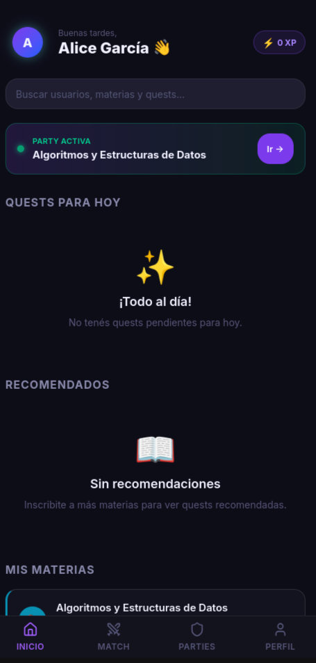
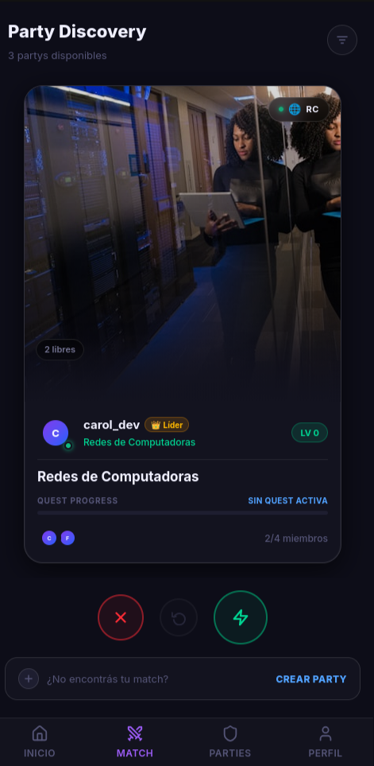
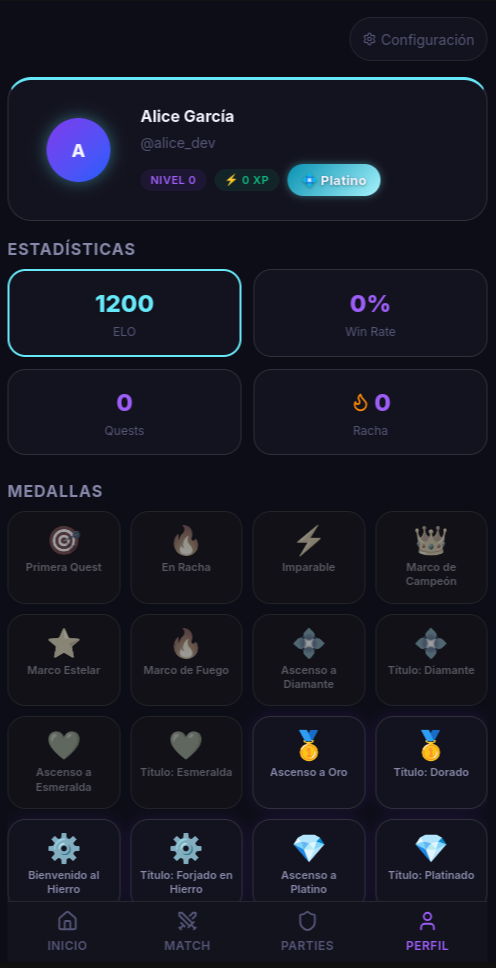
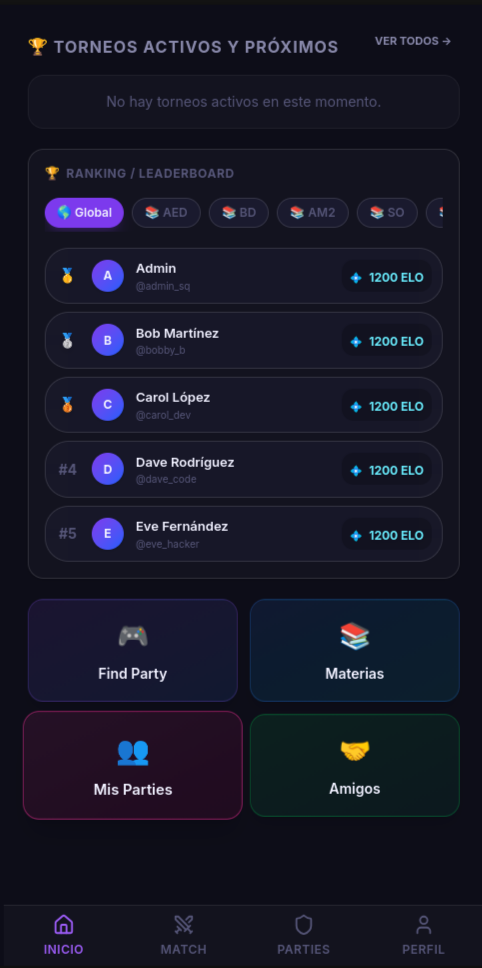

# StudyQuest 🎮📚

Plataforma de estudio colaborativo con matchmaking en tiempo real, salas de estudio (parties), chat enriquecido y quizzes/quests generados dinámicamente por Inteligencia Artificial a partir de apuntes o archivos PDF.

---

## Vistas de la Aplicación

A continuación se detallan las interfaces principales de la plataforma:

### 1. Panel de Control (Dashboard)

* **Descripción**: La pantalla de inicio centraliza el progreso del estudiante. Muestra un saludo personalizado con la experiencia actual del usuario, una barra de búsqueda global y acceso directo a la **Party Activa** a la que está unido actualmente. Adicionalmente, incluye las secciones de "Quests para Hoy" (tareas del día pendientes) y recomendaciones basadas en las materias inscritas por el estudiante.

### 2. Descubrimiento de Salas (Party Discovery)

* **Descripción**: La vista de matchmaking y exploración de grupos de estudio ("Parties"). Los estudiantes pueden visualizar tarjetas interactivas de grupos disponibles para materias específicas, ver el líder del grupo, el nivel promedio, la cantidad de miembros actuales (ej. `2/4 miembros`) y si tienen un Quest activo. Desde aquí se puede interactuar para unirse, omitir o crear una sala de estudio personalizada.

### 3. Perfil del Estudiante e Historial

* **Descripción**: Muestra los datos de perfil del usuario (nombre, nivel, rango de liga como "Platino" y botón de configuración). Incluye estadísticas clave de gamificación: **ELO competitivo** (sistema de emparejamiento numérico), porcentaje de victoria (**Win Rate**), número de **Quests** completados y la **Racha** de días activos de estudio. Debajo se encuentra la cuadrícula de medallas e insignias desbloqueadas (ej. "Primera Quest", "En Racha", "Ascenso a Oro", etc.).

### 4. Torneos y Clasificación (Leaderboard)

* **Descripción**: Panel dedicado a la comunidad competitiva de StudyQuest. Muestra los torneos activos y próximos, junto con la tabla de clasificación (**Ranking/Leaderboard**) global o filtrada por materias específicas (ej: AED, BD, SO). En la parte inferior, cuenta con un panel de accesos rápidos para buscar salas ("Find Party"), ver materias cursadas ("Materias"), gestionar salas propias ("Mis Parties") o administrar la lista de contactos ("Amigos").

---

## Estructura del Proyecto

El proyecto está diseñado siguiendo una arquitectura limpia y desacoplada en dos componentes principales y servicios de soporte:

- **`backend/`**: Servidor API RESTful y WebSocket en tiempo real construido con **NestJS 11** y **TypeScript**. Administra la persistencia de datos con **PostgreSQL 16** mediante **TypeORM** y el control de flujos efímeros con **Redis**. La generación de Quests utiliza **Google Gemini API** (usando `gemini-2.5-flash`) y un servicio microservicio **MarkItDown** de conversión de documentos.
- **`frontend/`**: Aplicación Single Page Application (SPA) responsiva y mobile-first construida con **React 19**, **Vite 8** y **Tailwind CSS 4**. Utiliza **Zustand 5** para la gestión de estado global ligero y persistente, y **Framer Motion 12** para animaciones interactivas de alta fidelidad.
- **`docker-compose.yml`**: Configuración de servicios locales virtualizados que incluye base de datos PostgreSQL, servidor de caché Redis y el motor MarkItDown Service.

---

## Tecnologías Utilizadas

### Backend Stack
* **Framework**: NestJS 11 (TypeScript)
* **Bases de datos**:
  * **PostgreSQL 16**: Datos transaccionales y relacionales normalizados.
  * **Redis 7.2**: Cola de matchmaking en tiempo real y persistencia volátil de socket presences.
* **ORM**: TypeORM 0.3
* **Comunicación en Tiempo Real**: Socket.IO (Nest Websockets)
* **IA y Parseo**:
  * **Google Generative AI**: Generación automatizada de quizzes tipo trivia a partir de textos.
  * **MarkItDown Service (Python/Uvicorn)**: Sidecar para la conversión estructurada de archivos PDF a Markdown para posterior ingesta en el LLM.
* **Pruebas**: Jest

### Frontend Stack
* **Framework**: React 19 + TypeScript 5.9
* **Empaquetador**: Vite 8
* **Estilos**: Tailwind CSS 4
* **Ruteo**: React Router 7 (React Router DOM)
* **Gestión de Estado**: Zustand 5
* **Gráficos**: Recharts
* **Tiempo Real**: Socket.IO Client 4
* **Animaciones**: Framer Motion 12
* **Pruebas**: Vitest + Testing Library

---

## ¿Por qué se utiliza Redis?

[Redis](https://redis.io/) es un motor de bases de datos en memoria ultrarrápido que opera directamente sobre la RAM, logrando latencias inferiores al milisegundo.

En **StudyQuest**, Redis cumple las siguientes funciones fundamentales:
1. **Matchmaking en tiempo real**: Alberga la cola activa de estudiantes buscando grupos de estudio de forma ágil, evitando sobrecargar PostgreSQL con consultas y escrituras constantes de intervalos cortos.
2. **Presencia y WebSockets**: Mantiene el registro dinámico de qué usuarios están conectados en las salas de estudio y facilita la distribución de eventos en tiempo real.

---

## Razones Técnicas de la Elección de PostgreSQL

| Aspecto | PostgreSQL | MongoDB |
|---|---|---|
| **Mapeo Relacional** | Nativo mediante Foreign Keys, restricciones e integridad referencial | Referencias manuales complejas y desnormalización propensa a inconsistencias |
| **Transaccionalidad** | Cumplimiento estricto de ACID nativo (ideal para transacciones de XP y ELO) | Soporte ACID limitado o costoso en arquitecturas distribuidas |
| **Tablas de Posiciones** | Funciones de ordenamiento (`ORDER BY`, `LIMIT`) nativas y eficientes con índices | Pipelines de agregación complejos y costosos para ordenamiento |
| **Estructuras Híbridas** | Soporte para columnas de tipo `JSONB` indexadas para datos semi-estructurados | Puramente documental y libre |

---

## Cómo Levantar el Proyecto Localmente

### 1. Variables de Entorno
Copia el archivo `.env.example` en la raíz del proyecto para crear tu archivo `.env`:
```bash
cp .env.example .env
```
Asegúrate de configurar las variables base, especialmente `GEMINI_API_KEY` (debe ser un API Key válido de Google AI Studio) y el modelo `GEMINI_MODEL=gemini-2.5-flash`.

### 2. Iniciar Infraestructura (Docker)
Inicia los servicios de bases de datos y microservicios ejecutando en la raíz del proyecto:
```bash
docker compose up -d postgres redis markitdown
```

### 3. Iniciar el Servidor Backend
Accede al directorio del backend, instala las dependencias e inicia el entorno de desarrollo:
```bash
cd backend
pnpm install
pnpm run start:dev
```
*Nota: Al arrancar por primera vez, TypeORM sincronizará automáticamente la estructura de tablas en PostgreSQL si `TYPEORM_SYNC=true` está configurado.*

### 4. Poblado de Datos Base (Seed)
Una vez que el backend haya sincronizado las tablas en PostgreSQL, corre el script de seeding en otra terminal dentro de la carpeta `backend/` para popular las materias, universidades y usuarios iniciales:
```bash
pnpm run seed
pnpm run seed:skill-tree
```

### 5. Iniciar el Servidor Frontend
Accede al directorio del frontend, instala las dependencias e inicia la interfaz interactiva:
```bash
cd ../frontend
pnpm install
pnpm run dev
```
La aplicación se abrirá en [http://localhost:5173](http://localhost:5173).

* **API Docs (Swagger)**: [http://localhost:3000/docs](http://localhost:3000/docs)
* **API Base URL**: [http://localhost:3000/api/v1](http://localhost:3000/api/v1)
